# 🌟 CaptionAI — Startup-Grade Pay-Per-Use AI MiniApp for Celo & MiniPay

<p align="center">
  
</p>

**CaptionAI** is a premium content generation dashboard built specifically for **Celo's MiniPay** (Opera's self-custodial stablecoin wallet with over 16M+ users) and general Celo Mainnet users.

Instead of forcing creators into expensive monthly subscriptions, CaptionAI operates on a **utility-based microtransaction model**. Users pay exactly **0.01 cUSD / USDC** (~₹0.80 INR) per AI generation on-chain. This micro-billing mechanism drives consistent, high-frequency transactions to the Celo network while making advanced AI content creation highly accessible.

---

## 🔗 Project Assets & Submission Links
- **Live dApp URL:** [https://caption-ai-self.vercel.app](https://caption-ai-self.vercel.app)
- **Backend API URL:** [https://caption-ai-or3z.onrender.com](https://caption-ai-or3z.onrender.com)
- **Demo Video (Max 4 mins):** [Watch Demo Video](YOUR_DEMO_VIDEO_LINK_HERE) 
- **Pitch Deck (Max 10 slides):** [View Pitch Deck](https://gamma.app/docs/Pay-per-use-AI-content-generation-for-MiniPay-zwin7rrhqvj109y?mode=doc) 

---

## 🚀 Celo Proof of Ship Checklist & Alignment

- [x] **Celo Mainnet Deployed:** Verified smart contracts deployed and active on Celo Mainnet.
- [x] **MiniPay Optimized:** Injected provider auto-detection, auto-connect, and high contrast 375px mobile-responsive design tailored for MiniPay's in-app browser.
- [x] **Multi-Token Fallback Support:** Smart wallet balance auto-detection supports both **cUSD** and **USDC** on Celo Mainnet.
- [x] **Smart Micro-allowance Caching:** Custom allowance pre-approval flow reducing double prompt signups to a single smooth click.
- [x] **Structured SEO & MPA Layout:** Multi-page architecture containing index-linked routes for Privacy, Terms, About, and Contact pages with Google PAA JSON-LD schemas.
- [x] **State-of-the-Art AI:** Integrated Gemini Pro models and high-resolution FLUX image generation architectures.

---

## 📅 Milestones & Progress (This Month)

All progress has been pushed directly to the `main` branch. Key code updates and milestones completed:
* **Celo Mainnet Deployments**: Deployed stable contracts for cUSD and USDC payments, configured with standard 0.01 micro-fees.
* **Dual-Token Client Auto-detection**: Implemented smart client-side logic to detect whether a user has `cUSD` or `USDC` in their wallet, dynamically adjusting contract addresses, ERC20 tokens, and decimal sizes.
* **Pre-flight Wallet Verification**: Added proactive balance checks to prevent users from submitting transactions that would fail on-chain.
* **Performance & Smooth Scrolling**: Optimized animation frame rates by shifting background meshes to GPU 3D-acceleration (`translate3d`, `will-change`) and resolved viewport double-scrollbars on WebKit/Chrome.
* **Backend Verification Pipeline**: Engineered a replay-safe, multi-token verification handler using `viem` to query event logs directly from the Celo blockchain.

---

## ⚠️ Problem

Existing social media and image generators lock users into expensive **monthly subscriptions ($15 to $40/month)**. 
For casual creators, indie hackers, and users in developing countries:
1. **High Barriers to Entry:** Paying a flat monthly fee for only 2 or 3 generations per month is unaffordable and inefficient.
2. **Onboarding Friction:** Web3 and blockchain apps often require complex transactions, causing high drop-off rates due to signing multiple approvals (ERC20 Approve + Call Contract) for simple actions.
3. **Single-Currency Dependence:** Apps that only accept a single stablecoin fail when users only have another major stablecoin (e.g. USDT/USDC vs cUSD) in their wallet.

---

## ✨ Solution

**CaptionAI** solves this by combining decentralized microtransactions with state-of-the-art AI:
1. **Pay-Per-Use Model:** Micro-billing charges exactly **0.01 cUSD / USDC** per generation. Users only pay for what they generate.
2. **Smart Allowance Pre-Approval:** Rather than forcing users to sign two prompts (Approve + Pay) every single time, CaptionAI prompts a one-time approval of 0.50 stablecoin (covering 50 generations). Future generations execute in **one single signature**.
3. **Smart Multi-Token Swapping:** Automatically detects if a user's `cUSD` balance is insufficient and switches to `USDC` dynamically to execute the payment transparently.
4. **Instant Validation & Output:** Generations complete in seconds, sending high-converting copy outputs and stunning visual elements straight to the client.

---

## 🎨 Technology Stack & Architecture

- **Smart Contracts (Solidity + Hardhat):**
  - Zero-custody fee processor that transfers cUSD/USDC directly from the user's wallet to a treasury address and emits a `GenerationPaid` log.
- **Backend (Express + Node + TypeScript + Viem + Gemini API + FLUX API):**
  - Listens to transaction hashes and queries Celo nodes directly via `viem` to check block status.
  - Verifies ERC20 receipts, sender, receiver, values, logs, and protects against replay attacks.
  - Runs Gemini & FLUX pipelines to return fully structured JSON captions and visual content.
- **Frontend (Vite + React 18 + TailwindCSS + Wagmi + Viem):**
  - Responsive layout with dark/light mode switcher, dynamic mesh gradients, and micro-interactions.

### 🔄 Architectural Data Flow

```mermaid
sequenceDiagram
    autonumber
    actor User as MiniPay / Celo User
    participant App as React Frontend
    participant Wallet as Wallet Provider
    participant Node as Celo Node (RPC)
    participant Server as Express Server
    participant Gemini as Gemini AI API

    User->>App: Input prompt & Select tone
    Note over App: Check wallet balance & select token (cUSD or USDC)
    Note over App: Check allowance for 0.01 token
    alt Allowance is 0
        App->>Wallet: Request Pre-Approval (0.50 token)
        Wallet->>App: Approve success (signed)
    end
    App->>Wallet: Transfer fee (payAndGenerate - 0.01 token)
    Wallet->>Node: Publish Transaction
    Wallet->>App: Return Transaction Hash (txHash)
    App->>Server: POST /api/generate (with txHash & prompt)
    rect rgb(30, 30, 45)
        Note over Server: Server Verification
        Server->>Node: Query Transaction Receipt (viem)
        Node-->>Server: Return transaction logs (Receipt)
        Server->>Server: Verify value == 0.01 token && Receiver == Treasury
        Server->>Server: Check if txHash has already been processed (Replay protection)
    end
    Server->>Gemini: Fetch generated text & prompts
    Gemini-->>Server: Return structured text JSON
    Server-->>App: Send final response to client
    App->>User: Display generated caption & copy to clipboard
```



---

## 📜 Deployed Contracts (Celo Mainnet)

* **cUSD Payment Contract:** [`0x4C534383A4158fC9C4a712213700ab6D7084343a`](https://celoscan.io/address/0x4C534383A4158fC9C4a712213700ab6D7084343a)
* **USDC Payment Contract:** [`0xf22e90Cc5E2198c2ad1e6a0edF620245a6b6fe13`](https://celoscan.io/address/0xf22e90Cc5E2198c2ad1e6a0edF620245a6b6fe13)

### Deployed Contracts (Celo Sepolia Testnet)
* **cUSD Payment Contract:** [`0x2C5334DDEaFfc6A56554401EcabD56b0E75Cf3B2`](https://sepolia.celoscan.io/address/0x2C5334DDEaFfc6A56554401EcabD56b0E75Cf3B2)

---

## ⚙️ Development & Local Setup

### 1. Smart Contracts
```bash
cd contracts
pnpm install
# Compile contracts
pnpm compile
# Run unit tests
pnpm test
```
* **Deploy to Celo Mainnet:** `npx hardhat run scripts/deploy.ts --network celoMainnet`

### 2. Backend Server
```bash
cd server
pnpm install
cp .env.example .env
# Start dev server
pnpm dev
```

### 3. Frontend Client
```bash
cd client
pnpm install
cp .env.example .env
# Start local host
pnpm dev
```

---

## 💡 Implementation Hurdle & Feedback

1. **ERC20 Token Decimals:** Handling USDC's 6 decimals versus cUSD's 18 decimals on-chain required meticulous conversion checks. We solved this by developing dynamic validation pipelines on both client and server layers to adjust scale factors based on the contract address.
2. **Double Scrollbar Glitches:** Initial Tailwind scroll wrappers triggered double-scrollbars on mobile views. Shifting overflow constraints solely to the `html` element and setting child page layouts to `overflow: visible` completely resolved this.
3. **MiniPay Provider Detection:** Handling lazy-loading injected providers inside Opera MiniPay was solved by configuring connection retry hooks in Wagmi to ensure users are never left with a blank or unresponsive connect button.
