# 🌟 CaptionAI — Startup-Grade Pay-Per-Use AI MiniApp for Celo & MiniPay

<p align="center">
  
</p>

**CaptionAI** is a premium content generation dashboard built specifically for **Celo's MiniPay** (Opera's self-custodial stablecoin wallet with over 16M+ users). 

Instead of forcing users into expensive monthly subscriptions, CaptionAI operates on a **utility-based microtransaction model**. Users pay exactly **0.02 cUSD** (~₹1.60 INR) per generation on-chain. This micro-billing mechanism drives consistent, high-frequency transactions to the Celo network while making advanced AI content creation accessible and cheap for everyone.

---

## 🚀 Celo Proof of Ship Checklist & Alignment

- [x] **MiniPay Optimized:** Silent auto-connection to MiniPay injected provider, high contrast 375px mobile-responsive design, and lightweight script sizes.
- [x] **Smart Micro-allowance Caching:** Custom allowance pre-approval flow reducing double prompt signups to a single smooth click.
- [x] **Verified On-Chain Contracts:** Deployed and validated contract emitting real-time event logs on Celo Sepolia.
- [x] **Structured SEO & MPA Layout:** Multi-page application structure featuring index-linked routes for Privacy, Terms, About, and Contact pages alongside structured Google PAA JSON-LD schema.
- [x] **State-of-the-Art AI:** Integrated with Gemini's newest generation text models and high-resolution FLUX image generation architectures.

---

## 🎨 Technology Stack & Architecture

- **Smart Contracts (Solidity + Hardhat):**
  - Zero-custody fee processor that transfers cUSD directly from the user's wallet to a treasury address and emits a `GenerationPaid` log.
- **Backend (Express + Node + TypeScript + Viem + Gemini API + FLUX API):**
  - Listens to transaction hashes and queries Celo nodes directly via `viem` to check block status.
  - Verifies ERC20 receipts, sender, receiver, values, logs, and protects against replay attacks.
  - Runs Gemini & FLUX pipelines to return fully structured JSON captions and visual content.
- **Frontend (Vite + React 18 + TailwindCSS + Wagmi + Viem):**
  - Responsive multi-column layout with dark/light mode switcher, dynamic mesh gradients, and micro-interactions.

### 🔄 Architectural Data Flow

```mermaid
sequenceDiagram
    autonumber
    actor User as MiniPay User
    participant App as React Frontend
    participant Wallet as MiniPay Wallet
    participant Node as Celo Node (RPC)
    participant Server as Express Server
    participant Gemini as Gemini AI API

    User->>App: Input prompt & Select tone
    Note over App: Check allowance for 0.02 cUSD
    alt Allowance is 0
        App->>Wallet: Request Pre-Approval (0.50 cUSD)
        Wallet->>App: Approve success (signed)
    end
    App->>Wallet: Transfer fee (payAndGenerate - 0.02 cUSD)
    Wallet->>Node: Publish Transaction
    Wallet->>App: Return Transaction Hash (txHash)
    App->>Server: POST /api/generate (with txHash & prompt)
    rect rgb(30, 30, 45)
        Note over Server: Server Verification
        Server->>Node: Query Transaction Receipt (viem)
        Node-->>Server: Return transaction logs (Receipt)
        Server->>Server: Verify value == 0.02 cUSD && Receiver == Treasury
        Server->>Server: Check if txHash has already been processed (Replay protection)
    end
    Server->>Gemini: Fetch generated text & prompts
    Gemini-->>Server: Return structured text JSON
    Server-->>App: Send final response to client
    App->>User: Display generated caption & copy to clipboard
```



---

## 🎨 Premium UI/UX Optimization: Smart Allowance Pre-Approval

To save users from signing **two wallet prompts** (Approve ERC20 + Pay Contract) for every single generation, CaptionAI implements a smart pre-approval workflow:
1. When the user taps **Generate**, the client checks their remaining cUSD allowance.
2. If the allowance is less than `0.02 cUSD`, the client requests a one-time approval of **0.50 cUSD** (enough to cover 25 generations).
3. For subsequent generations, the allowance check passes automatically, and the user signs **exactly one prompt** (the `payAndGenerate` fee transfer) directly inside MiniPay.

---

## 📁 Project Structure

```
caption-ai/
├── contracts/          # Hardhat contracts workspace
│   ├── contracts/      # Solidity source code (Payment contract, Mock token)
│   ├── scripts/        # Deployment scripts (target-aware)
│   └── test/           # Hardhat unit tests
├── server/             # Express server API
│   └── src/            # TypeScript entry point (viem validator + Gemini integration)
└── client/             # React frontend app
    ├── src/            # Vite entry files, hooks, views, and styling variables
    └── index.html      # Meta and Web App manifest links
```

---

## 📦 Getting Started

### 1. Smart Contracts Setup

Navigate to the `contracts/` directory and install dependencies:
```bash
cd contracts
pnpm install
```

Configure your environment variables by copying `.env.example`:
```bash
cp .env.example .env
```
Fill in your `PRIVATE_KEY` (containing testnet/mainnet CELO/cUSD) and your `CELOSCAN_API_KEY`.

**Available Scripts:**
- `pnpm compile` — Compiles Solidity contracts.
- `pnpm test` — Runs the test suite verifying forwarding, allowance rules, and ownership controls.
- `pnpm deploy:sepolia` — Deploys to Celo Sepolia Testnet.
- `pnpm deploy:mainnet` — Deploys to Celo Mainnet.

#### Deployed Address (Celo Sepolia Testnet):
- **CaptionAIPayment:** [`0x2C5334DDEaFfc6A56554401EcabD56b0E75Cf3B2`](https://sepolia.celoscan.io/address/0x2C5334DDEaFfc6A56554401EcabD56b0E75Cf3B2)
- **MockcUSD Token:** [`0xdE9e4C3ce781b4bA68120d6261cbad65ce0aB00b`](https://sepolia.celoscan.io/address/0xdE9e4C3ce781b4bA68120d6261cbad65ce0aB00b)

---

### 2. Backend Server Setup

Navigate to the `server/` directory and install dependencies:
```bash
cd ../server
pnpm install
```

Create a `.env` file:
```bash
cp .env.example .env
```
Provide the required variables:
- `GEMINI_API_KEY`: API Key from Google AI Studio.
- `CONTRACT_ADDRESS`: The deployed `CaptionAIPayment` contract address.
- `CELO_RPC_URL`: Set to `https://forno.celo.org` for Mainnet, or keep default Sepolia.

**Available Scripts:**
- `pnpm dev` — Starts the development server with hot-reloading at `http://localhost:3001`.
- `pnpm build` — Compiles TypeScript into JS output in `dist/`.
- `pnpm start` — Runs the compiled server.

---

### 3. Frontend Client Setup

Navigate to the `client/` directory and install dependencies:
```bash
cd ../client
pnpm install
```

Configure environment variables. Create a `.env` file:
```env
VITE_CONTRACT_ADDRESS=0x2C5334DDEaFfc6A56554401EcabD56b0E75Cf3B2
VITE_API_BASE_URL=http://localhost:3001
```

**Available Scripts:**
- `pnpm dev` — Starts Vite dev server locally at `http://localhost:3000`.
- `pnpm build` — Compiles and bundles React client for production build.

---

## 🔒 Security & Replay Protection

The Express backend implements strict security checks:
- **Receipt Querying:** Queries the Celo RPC directly using `viem` to verify that the transaction receipt exists, succeeded, and targeted the correct contract address.
- **Log Verification:** Parses the receipt logs to check if the `GenerationPaid` event was emitted, verifying that the user address matches the prompt requestor.
- **Replay Protection:** Keeps track of processed transaction hashes. If a transaction hash is sent twice, the backend rejects it instantly, ensuring each micro-fee is only used once.
